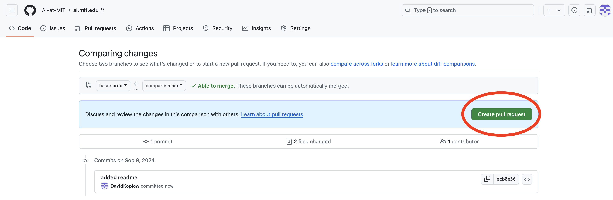
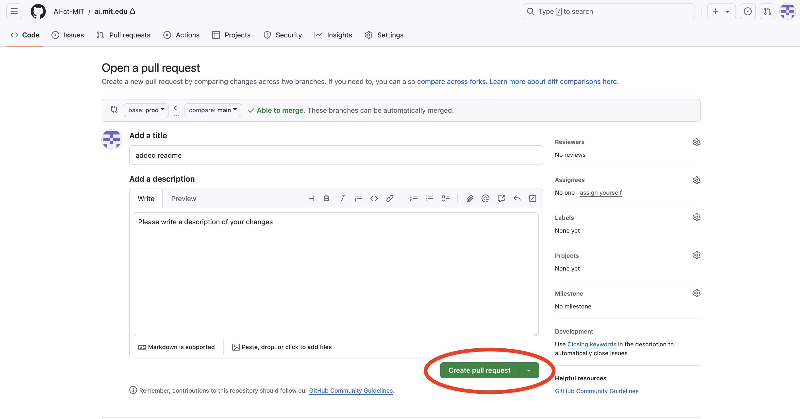
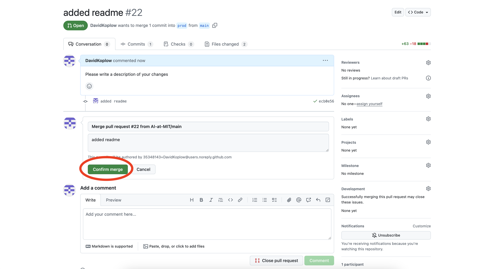
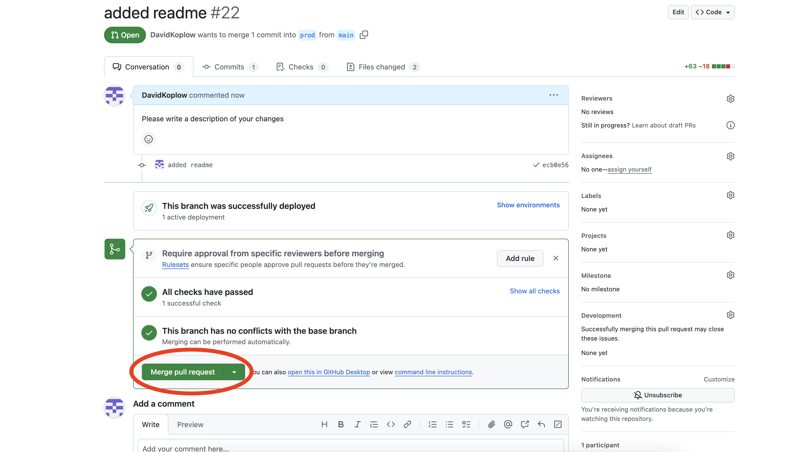
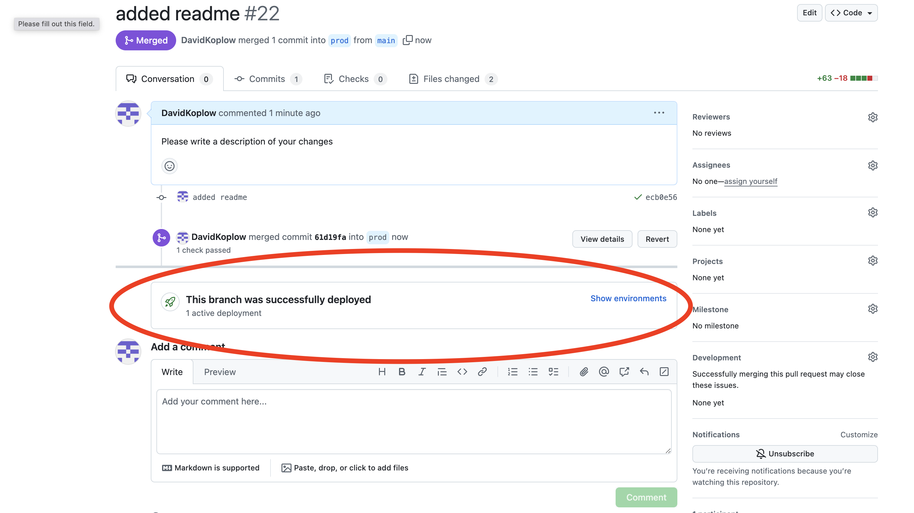

# Website for AI@MIT.


## To deploy site changes

NOTE: **The prod branch is in active deployment.**

0) make sure you have node and NextJs installed. See tutorial [here](https://nextjs.org/docs/getting-started/installation).
1) Clone the main branch
2) Run `npm run dev` to make sure everything is installed and runs correctly
3) Make your modifications
4) Run `npm run build` to make sure your code builds and is type safe
5) Push to main branch
6) Create a [pull request](https://github.com/AI-at-MIT/ai.mit.edu/pulls) to pull the `main` branch into the `prod` branch. 

7) Then follow the steps to complete it shown below. Note, if it doesn't build this won't work and you'll have to fix the errors.




8) After a couple minutes the site should be deployed at [ai-at-mit.com](https://www.ai-at-mit.com/). If there are errors in the pull request or the site isn't updated, there might be an issue with Vercel. This can be solved by redeploying the organization on the Vercel account (you might need to make a new account) and updating domain redirects on NameCheap to go to the new Vercel deployment site.


## To update Exec:
1) Navigate to the `public/exec` folder
2) Create a new folder titled `"[$startyear]-[$startyear + 1]_exec"`and enter this folder
4) Add square high resolution colored photos for each person on exec
5) Create a json called `exec_info.json` and fill it with the exec information for the upcoming year. The format is shown below. 
Note: imageSource should just be the name of the image in the same folder as the json file. The actual link is calculated in the code:
```
[
  {
    "name": "David Koplow",
    "position": "Co-President",
    "imageSource": "david_headshot.jpg",
    "link": "https://www.linkedin.com/in/david-koplow/",
    "type": ["aim", "p"] //list keys for all initiatives they help run
  },
  {
    "name": "",  // Add a name if available
    "position": "",  // Add a position if available
    "imageSource": "",  // Add an image source if available
    "link": "",  // Add a link if available
    "type": []  // Add types if available
  }, 
  ...
]
```
6) The website should show the most recent year on the first page and all exec on the page `/pastexec`.

## To add a new initiative:
1) Add a new `(initiative)-icon.svg` logo to `public/icons`, and `(initiative)-backdrop.svg` to `public/backdrops`
2) Add a name and gradient in the `$initiatives` variable in `globals.scss` 
3) Add the initiative information in `initiative_data` from `@components/util/constants.tsx`
4) Create a page for the initiative in app/router, you can copy an existing one as a template
5) Customize the page

Note: SVGs can sometimes display blurry on mobile due to their structure. When making these on Figma I often made a rectangle with a gradient and applied a mask on the front to display. Don't do this. It will lead to blurry SVGs on many IOS devices. An easy fix is just convert the drawing to a single path, and fill with a gradient. 

## How does the Calendar work?

### Airtable Integration

It's linked to this Airtable:
[https://airtable.com/appwsdSUA3MAMj2SW/tblo3Qd38F4wTMQM9/viwziEODMM6TBVeuY?blocks=hide](https://airtable.com/appwsdSUA3MAMj2SW/tblo3Qd38F4wTMQM9/viwziEODMM6TBVeuY?blocks=hide). 

The airtable automatically imports data from this Google Calandar every few minutes: 
[https://calendar.google.com/calendar/u/0?cid=Y18xN2EwODA0ZjBiMjM5MzRlY2E4MWI5ZTU5ZmM4MmI4M2QyZDQ4NWNkNjU3NDFiYzQyNmViZGJkMGM0NTkyYTVhQGdyb3VwLmNhbGVuZGFyLmdvb2dsZS5jb20](https://calendar.google.com/calendar/u/0?cid=Y18xN2EwODA0ZjBiMjM5MzRlY2E4MWI5ZTU5ZmM4MmI4M2QyZDQ4NWNkNjU3NDFiYzQyNmViZGJkMGM0NTkyYTVhQGdyb3VwLmNhbGVuZGFyLmdvb2dsZS5jb20)

The issue is that Airtables stop syncing automatically if they aren't accessed for a while. I attempted to solve this with a Make automation ([https://us2.make.com/55724/scenarios/67862/edit](https://us2.make.com/55724/scenarios/67862/edit)) that would update the table, but it seems to have crashed because you can't upsert records into synced tables without premium on Airtable. If you notice the calendar not syncing anymore, try logging onto the airtable and manually refreshing. This should start the automatic syncing again. Also feel free to try a different automation to solve this or pay for Airtable premium. 

Both accounts are accesed through the Gmail [ai.at.mit.master@gmail.com](mailto:ai.at.mit.master@gmail.com). Exec should have password. 

### Google Calendar Formatting

Assuming nothing breaks, the calendar on the site should load all events from the Google Calandar and display recent and upcoming ones (check code in `src/components/util/airtable.tsx` for exactly how this is decided). Events will also display with tags such as Done, Today, Now, and Future when they're coming up or over. 

To render correctly on the website there's a simple formatting procedure of events. The fields are described below:

* **Title:** You can put whatever name you'd like, hover make sure to add `[$Initiative]` to the end. Where $Initiative is Labs, Workshops, Reading, AIM, ect. Also add an `!` if it's important and it will display with an important tag and have a higher priority to display on the website. For example, [AIM!] or [Workshops!] would display as important.  
* **Location:** MIT room number, but remember this is public so if it is a **private event don't list the room number here**.
* **Time:** You can just put whatever time the event takes place. The end time will appear when the event is pressed on the website. If an event is all day it won't show a start time on the website, only a date, but will show an end time. Events that span multiple days should work fine too.
* **Description:** You can write however long description you want. Longer descriptions will be abbriviated with ... on the website, and the full description will be shown when someone presses that event tag. URLs in descriptions are fine, and should be rendered correctly on the site as well. The implementation is a bit suss and involves setting the internal html of the calendar tag to the content of the event. I do santize it and remove anything that's not a paragraph or link, but still be careful, and you're welcome to change the implementation.


## What if you're running into issues?

Hopefully the refactoring I did and this readme make it possible to figure out most issues. 

But I'm happy to chat, feel free to reach out to me (David Koplow) via text: *617-893-5672*